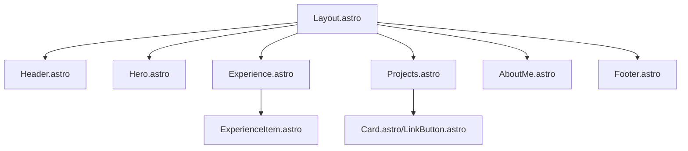

# 👨🏻‍💻 Portafolio Profesional - Ing. Javier Alburges

## 📝 Descripción Corta
Portafolio web moderno y minimalista desarrollado con **Astro** y **Tailwind CSS**. Diseñado para destacar la trayectoria profesional, proyectos tecnológicos y habilidades técnicas de Javier Alburges, Ingeniero Mecánico y CEO de GearSoftCA.

---

## 📋 Tabla de Contenido
1. [Descripción General](#-descripción-general)
2. [Arquitectura](#-arquitectura)
3. [Flujo de Datos](#-flujo-de-datos)
4. [Inicio Rápido](#-inicio-rápido)
5. [API e Integraciones](#-api-e-integraciones)
6. [Estructura del Proyecto](#-estructura-del-proyecto)
7. [Configuración](#-configuración)
8. [Deployment](#-deployment)
9. [Troubleshooting](#-troubleshooting)

---

## 🚀 Descripción General
Este proyecto es una vitrina digital autoadministrable que utiliza las ventajas del renderizado estático de **Astro** para ofrecer una velocidad de carga excepcional. El portafolio no solo enumera habilidades, sino que profundiza en la experiencia de Javier Alburges liderando **GearSoftCA**, integrando soluciones de software con ingeniería industrial.

---

## 🏗️ Arquitectura
El proyecto sigue una arquitectura de **Componentes en Islas (Islands Architecture)** propia de Astro, donde la mayor parte del sitio es HTML estático, con islas de interactividad donde es necesario.



---

## 🔄 Flujo de Datos
El flujo de datos es principalmente **unidireccional y estático**:
1.  **Definición de Datos**: Los datos de proyectos y experiencia se definen como constantes dentro de los componentes `.astro` (ej. `Projects.astro`).
2.  **Propagación**: Los componentes padres pasan estos datos a componentes hijos (ej. `Experience` -> `ExperienceItem`) mediante *props*.
3.  **Renderizado**: Astro procesa estos componentes en tiempo de construcción (build time) para generar archivos HTML puros.

---

## ⚡ Inicio Rápido

Para ejecutar este proyecto localmente:

1.  **Clonar el repositorio:**
    ```bash
    git clone https://github.com/JavierAlburges/IngJavierAlburges.git
    cd IngJavierAlburges
    ```

2.  **Instalar dependencias:**
    ```bash
    npm install
    ```

3.  **Iniciar servidor de desarrollo:**
    ```bash
    npm run dev
    ```

4.  **Construir para producción:**
    ```bash
    npm run build
    ```

---

## 🔌 API e Integraciones
-   **Fontsource**: Utiliza la variable de fuente `Onest` para una tipografía moderna.
-   **Tailwind CSS**: Framework de utilidades para el diseño responsive y dark mode.
-   **Lucide-like Icons**: Componentes de iconos personalizados dentro de `src/components/icons`.
-   **Astro Transitions**: Implementa `ViewTransitions` para navegaciones suaves entre secciones.

---

## 📂 Estructura del Proyecto
```text
/
├── public/           # Archivos estáticos (imágenes, favicons)
├── src/
│   ├── components/   # Componentes UI (Boton, Card, Secciones)
│   │   └── icons/    # Iconos SVG como componentes Astro
│   ├── layouts/      # Plantilla base (Layout.astro)
│   └── pages/        # Rutas del sitio (index.astro)
├── astro.config.mjs  # Configuración principal de Astro
└── tailwind.config.mjs # Configuración de estilos Tailwind
```

---

## ⚙️ Configuración
-   **Astro Config**: Configurado para generar un sitemap automáticamente y soportar Tailwind CSS.
-   **Tailwind Config**: Define la paleta de colores y las fuentes personalizadas basadas en Fontsource.

---

## 🌐 Deployment
El sitio está optimizado para desplegarse en **Vercel**, **Netlify** o **GitHub Pages**. Al ser una aplicación Astro estática, solo requiere ejecutar `npm run build` y servir la carpeta `dist/`.

Para Vercel:
1. Conecta tu repo en el Dashboard.
2. Framework Preset: `Astro`.
3. Command: `npm run build`.

---

## 🛠️ Troubleshooting
-   **Error de dependencias**: Borra `node_modules` y `package-lock.json`, luego ejecuta `npm install`.
-   **Imágenes no cargan**: Asegúrate de que las rutas en `src/components/Projects.astro` coincidan exactamente con archivos en `public/projects/`.
-   **Fuentes**: Si la fuente no se visualiza, verifica que `@fontsource-variable/onest` esté en el `package.json`.

---

<div align="center">
Desarrollado con ❤️ por Javier Alburges
</div>
